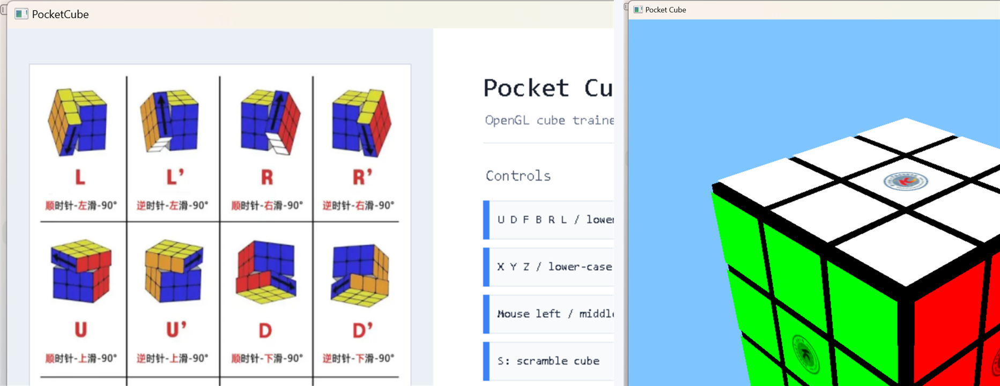

# Pocket Cube



Pocket Cube is a C++ course-design project for visualizing, scrambling, and solving a 2x2 cube. It uses OpenGL/freeglut/GLEW for the 3D cube view and EasyX for the control/help window.

## Features

- Interactive 3D pocket cube display
- Keyboard face rotations and whole-cube rotations
- Mouse camera controls
- Random scramble
- Automatic recovery/solve flow
- VS Code build and debug configuration for Windows

## Requirements

- Windows
- Visual Studio 2022 Community or Build Tools with MSVC v143
- Windows 10 SDK 10.0.18362.0 or newer
- EasyX installed under the Visual Studio `VC\Auxiliary\VS` directory
- VS Code with the Microsoft C/C++ extension

The required OpenGL/freeglut/GLEW headers, libraries, and runtime DLLs are vendored under `vendor/` because the original Visual Studio project depends on these NuGet package contents directly.

## Run in VS Code

1. Open this repository folder in VS Code.
2. Press `Ctrl+Shift+B` and run the default task: `build debug x64`.
3. Press `F5` and run: `Pocket Cube (Debug x64)`.

The build task calls `scripts/build-debug-x64.cmd`, which initializes the Visual Studio developer environment and builds `PocketCube.sln`. The debugger starts `bin/x64/Debug/PocketCube.exe` with the repository root as the working directory, so assets can be loaded from `assets/`.

## Controls

- `U D F B R L` and lower-case variants: rotate cube faces
- `X Y Z` and lower-case variants: rotate the whole cube
- Mouse left, middle, and right buttons: adjust the camera
- `S`: scramble the cube
- `Enter`: auto solve

## Project Layout

```text
.
├── assets/                  Runtime images and texture files
├── src/                     C++ source code split by responsibility
├── scripts/                 VS Code build/clean helper scripts
├── vendor/                  Vendored OpenGL/freeglut/GLEW package files
├── .vscode/                 VS Code tasks, debugger, and IntelliSense config
├── PocketCube.sln           Visual Studio solution
└── PocketCube.vcxproj       MSBuild C++ project
```

Generated files are written to `bin/` and `build/`; both directories are ignored by Git.

## Source Modules

- `PocketCube.h`: shared declarations, global state, and function prototypes
- `PocketCube.cpp`: program entry point
- `state.cpp`: cube state, render colors, animation flags, and face vertex data
- `init_ui.cpp`: OpenGL initialization, cube color initialization, and EasyX help UI
- `texture.cpp`: BMP texture loading
- `cube_moves.cpp`: cube color-state transformations
- `geometry.cpp`: face checks, animated rotations, and camera movement helpers
- `solver_first_layer.cpp`: first-layer recovery steps
- `solver_middle_layer.cpp`: middle-layer edge recovery
- `solver_last_layer_orient.cpp`: last-layer orientation
- `solver_last_layer_permute.cpp`: last-layer permutation
- `solver_driver.cpp`: solve path setup and automatic recovery driver
- `input.cpp`: keyboard, mouse, scramble, and auto-recovery callbacks
- `render.cpp`: OpenGL drawing routine
